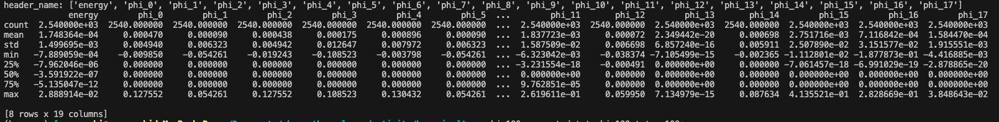
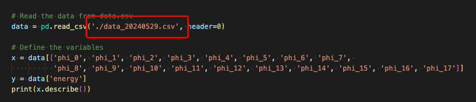

# bayesian implement
## 安装
```
   pip install numpy, pandas, pymc3, re
```
## 使用
为了避免混乱，把这部分代码放在bayesian目录下。
1. txt文件的数据格式转成csv
   在dataset.py中修改输入的txt文件，指定转换后的csv文件名称。
   
   配置完成后运行：
   ```
   python dataset.py
   ```
   

   有2540条数据，数据的相关信息意义参考：

1. 将 bayesian 代码用pymc3实现。
   在estimate.py中修改输入的csv文件
   
   修改完成后运行：
   ```
   python estimate.py
   ```
   

   这个图片的意义参考网络文档：