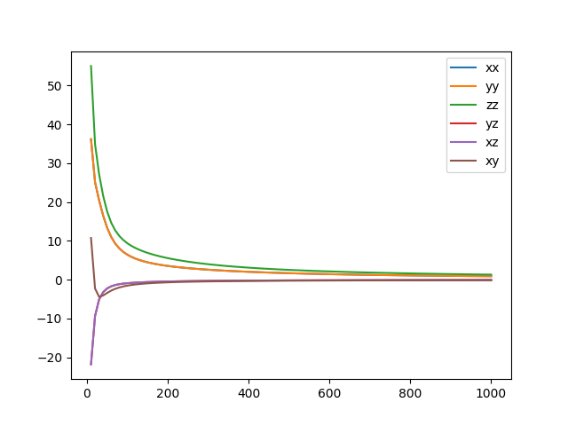

## 介绍
输入的文件：
graph18-compress0.pb # 该文件太大，无法上传git

POSCAR_BZO_ROTATION

in_template.lammps # 运行自动流程脚本需要
## 运行
1. 热导计算，输出heat.txt
```python workflow.py```
2. 基于heat.txt，结果展示
```python heat-plot.py
```


## 程序运行的过程解释和说明
https://www.notion.so/0632b5a9bf9f45d7945525d8d82211b2?pvs=4
## 备注
1. the bzo example will take 1h in mpirun with np=10, and 517 cases.

2. 
  ```
phono3py --fc3 --fc2 --dim="1 1 1" --mesh="11 11 11"  --br --tmin=10 --tmax=1000 > Heat.txt &
```

will take a while depend on --mesh="11 11 11"

notes:
2024.5.10：根据平台后端仓库：
https://github.com/ZJLCompMat/MatCalCore/blob/main/DPA_core/MatCalCore.py#L99
修改程序，整合成可以与平台后端统一的程序，后续供平台组统一集成。
修改内容：
1. 暴露参数，用argparse：POSCAR
2. 暴露相关的config可调节参数，例如dim mesh
3. 将文件的读取与保存放在指定的工作目录中
   
  以上程序整合完成后放在另外一个分支:matcalcore.

2024.5.13
1.  run ok in branch:matcalcore at zj@10.15.64.44

2024.5.16
1. 毕老师整理default_pbc.json中的参数结构
2. 毕老师修改了bug
```
    # com_2_251 = ["phono3py", "--sym-fc"]  # phono3py版本2.5.1
    com_2_303 = ["phono3py", "--sym-fc", "phono3py_disp.yaml"]  #phono3py版本3.0.3

```
3. 将heat-plot功能放到workflow.py中的step_7
4. 增加requirements.txt， 显示了程序运行环境下的部分python package版本。